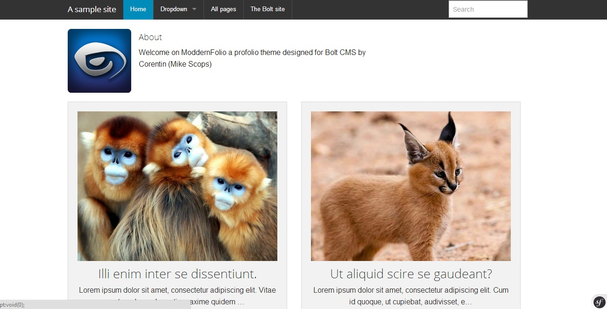

#ModdernFolio Bolt Theme

**Note:**  This is for Bolt 3. Check out the `bolt-v2` branch for a Bolt 2 compatible version.

## Theme Installation

1/ Upload all the files in your theme directory.

2/ Set your path theme in the config.yml (you can do it from the bolt admin interface)

3/ And voilà !

You can also download this theme throught the [Bolt Market](https://market.bolt.cm/).

## Homepage configuration

To show your own post type on the homepage you need to modify the index.twig template on line 16, change "entries" by what you want.

To configure your profile header, create an about page > upload your profile picture and add your description in the textarea.

This theme is fully responsive, so you don't need any mobile template.

## Authors

|  |
|---|
| [Corentin Mors](https://pixelswap.fr/) |

*Don't sell it as your own theme.*